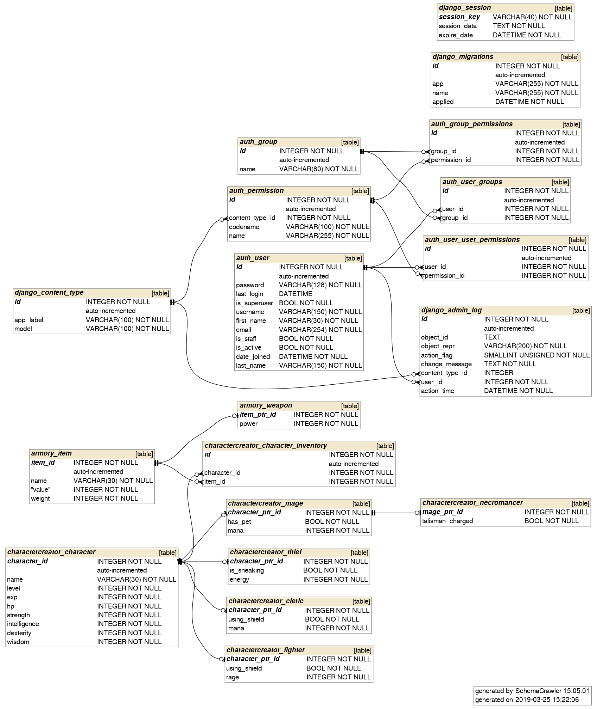

# Introduction to SQL

The basics of Structured Query Language, a relatively simple query language.

## Objectives

- Write basic SQL queries to get specific subsets of data from a database and answer basic "business questions"
- Understand the purpose of SQL join, and perform joins to access data from
  multiple tables

## Preparation

The Python Standard Library includes a module
[sqlite3](https://docs.python.org/3/library/sqlite3.html), an API for data
persistence via the SQLite - a simple disk-based database that doesn't require a
separate server process.

Also, check out the [DB Browser for SQLite](https://sqlitebrowser.org) - we'll emphasize using `sqlite3` from Python so we can do things programmatically, but it is encouraged to install the DB Browser as a helpful utility for ad hoc inspection and querying.

## Task

We'll work together with SQLite in Python, making and exploring a simple
database and trying a range of basic queries. Focus will be on the following SQL
keywords:

- `SELECT` - how we choose which columns to get
- `WHERE` - how we set conditions on the rows to be returned
- `LIMIT` - when we only want a certain number of rows
- `ORDER` - when we want to sort the output
- `JOIN` - when we need data from multiple tables combined

We'll also learn about how to use `CREATE TABLE` to specify a schema for our
data, and `INSERT` statements to put data into a table. And lastly, we'll learn
how to calculate some basic statistics with `COUNT()`, `AVG()`, and `SUM()`,
organized using the keyword `GROUP`.

## Work to do - Part 1, Querying a Database

This directory contains a file `rpg_db.sqlite3`, a database for a hypothetical webapp role-playing game. This test data has dozens-to-hundreds of randomly
generated characters across the base classes (Fighter, Mage, Cleric, and Thief) as well as a few Necromancers. Also generated are Items, Weapons, and connections from characters to them. Note that, while the name field was randomized, the numeric and boolean fields were left as defaults.

Use `sqlite3` to load and write queries to explore the data, and answer the
following questions:

- How many total Characters are there?
- How many of each specific subclass?
- How many total Items?
- How many of the Items are weapons? How many are not?
- How many Items does each character have? (Return first 20 rows)
- How many Weapons does each character have? (Return first 20 rows)
- On average, how many Items does each Character have?
- On average, how many Weapons does each character have?

You do not need all the tables - in particular, the `account_*`, `auth_*`,
`django_*`, and `socialaccount_*` tables are for the application and do not have
the data you need. the `charactercreator_*` and `armory_*` tables and where you
should focus your attention. `armory_item` and `charactercreator_character` are
the main tables for Items and Characters respectively - the other tables are
subsets of them by type (i.e. subclasses), connected via a key (`item_id` and
`character_id`).

While you can use the DB Browser or other tools to explore the data and work on your queries if you wish, but you should write a file
`rpg_queries.py` that imports `sqlite3` and programmatically executes and
reports results for the above queries.

[Subqueries](https://www.w3resource.com/sql/subqueries/understanding-sql-subqueries.php)
and [aggregation functions](https://www.sqltutorial.org/sql-aggregate-functions/)
may be helpful for putting together more complicated queries.

##  Part 2, Making and populating a Database

Load the data (use `pandas`) from the provided file `buddymove_holidayiq.csv`
(the [BuddyMove Data
Set](https://archive.ics.uci.edu/ml/datasets/BuddyMove+Data+Set)) - you should
have 249 rows, 7 columns, and no missing values. The data reflects the number of
place reviews by given users across a variety of categories (sports, parks,
malls, etc.).

Using the standard `sqlite3` module:

- Open a connection to a new (blank) database file `buddymove_holidayiq.sqlite3`
- Use `df.to_sql`
  ([documentation](https://pandas.pydata.org/pandas-docs/stable/reference/api/pandas.DataFrame.to_sql.html))
  to insert the data into a new table `review` in the SQLite3 database

Then write the following queries (also with `sqlite3`) to test:

- Count how many rows you have - it should be 249!
- How many users who reviewed at least 100 `Nature` in the category also
  reviewed at least 100 in the `Shopping` category?
- What are the average number of reviews for each category?

Your code is saved in `buddymove_holidayiq.py`.

## Resources

For a more complicated example SQLite database with a number of tables to play
with, check out this [SQLite Sample
Database](https://www.sqlitetutorial.net/sqlite-sample-database/).

The RPG data also exists in a [JSON
file](https://github.com/LambdaSchool/Django-RPG/blob/master/testdata.json) -
try loading it with the standard [json
module](https://docs.python.org/3.5/library/json.html), and reproducing the
above queries with direct manipulation of the Python dictionaries. Also, try to
load it into a `pandas` dataframe and reproduce the above queries with
appropriate dataframe function calls.

This database is part of a Django (Python webapp framework) application, the
[Django-RPG](https://github.com/LambdaSchool/Django-RPG/tree/master) - check it
out, and (though this is very much a stretch goal) you can [get started with
Django](https://www.djangoproject.com/start/) and see if you can run it
(definitely use `pipenv`!). If you are able to, then you can use the the [Django
ORM](https://docs.djangoproject.com/en/2.1/topics/db/) (object-relational
mapping, a way to interact with SQL through programming language objects), and
[query](https://docs.djangoproject.com/en/2.1/topics/db/queries/) the data.
You'll find that the questions we answered with pure SQL are remarkably simple
to answer using the ORM.

The RPG data was generated using
[django-autofixture](https://github.com/volrath/django-autofixture), a tool that
facilitates tests by randomly generating data. Check it out, and if you got
Django working, see if you can generate more data.

_____

**CRUD:** Stands for Create Read Update Delete are the main functionality of any web application that a database needs to support.

### sqlite3
sqlite3 module is an API for data persistence via the SQLite - a simple disk-based database that doesn't require a separate server process. We use DB Browser for SQLite utility for ad hoc inspection and querying.

**_Read_ operation in CRUD:**
Here are the steps to make a query with sqlite3 in python repl.
```
import sqlite3
conn = sqlite3.connect(`rpg_db.sqlite3’)        # connect to an existing db or create a new one
curs = conn.cursor()                                # make a cursor to iterate over the db
query = ‘SELECT * FROM armory_item;’        # write query
curs.execute(query)                                # execute the query
results = curs.fetchall()                        # fetch the results
results[:5]                                        # results is a list of tuples, 1st 5 rows
```
**Create operation in CRUD:**
Inserting data into columns of a table.
```
import sqlite3
conn = sqlite3.connect(‘test_db.sqlite3’)        # create a new db file
create_statement =  ‘CREATE TABLE test (name char(20), age int);’
curs = conn.cursor()
curs.execute(create_statement)                # create the test table
insert_statement = ‘INSERT INTO test (name, age) VALUES (“John”, 20);’
curs.execute(insert_statement)
curs.execute(‘SELECT * FROM test;’)
curs.fetchall()
curs.close()                                        # closing up the cursor
conn.commit()                                        # save the changes
```


* For multiline string query we use triple double quotes instead of single quotes.
* Adding the keyword `EXPLAIN` to the beginning of a quote shows the internal steps that the SQL engine takes to execute the query.
* Commenting out on sqlite is with `--`.
* We can use the integer numbers 1, 2, .. to refer to columns in SELECT in the order they were declared.
* Use comma to separate multiple values of the same kind in the query
* Implicit join or JOIN by itself is an INNER JOIN by default.


**examples:**

* `SELECT name, COUNT(*) FROM charactercreator_character GROUP BY 1 ORDER BY 2 DESC LIMIT 5;`
* ` SELECT character_id, name, rage FROM charactercreator_character INNER JOIN charactercreator_fighter ON character_id = charcter_ptr_id WHERE charcater_id BETWEEN 40 and 50`        -- this is an explicit inner join
* ` SELECT character_id, name, rage FROM charactercreator_character, charactercreator_fighter WHERE character_id = charcter_ptr_id AND character_id BETWEEN 40 and 50;`        -- equivalent implicit join
* Associate every character name with its item
   * `SELECT cc.character_id, cc.name AS character_name, ai.item_id, ai.name AS item_name FROM charactercreator_character AS cc, armory_item AS ai, charactercreator_character_inventory AS cci WHERE cc.character_id = cci.character_id AND ai.item_id = cci.item_id;`        -- implicit multi table join
   * Note: cc: 302 rows, ai: 174 rows, cci=898 rows >> output=898 rows. In other word INNER JOIN does not group primary id columns.
* How many items each character name has?
   * `SELECT character_name, COUNT(DISTINCT item_id) FROM
      (SELECT cc.character_id, cc.name AS character_name, ai.item_id, ai.name AS item_name FROM charactercreator_character AS cc, armory_item AS ai, charactercreator_character_inventory AS cci WHERE cc.character_id = cci.character_id AND ai.item_id = cci.item_id)
      GROUP BY 1 ORDER BY 2 DESC;`
    * The character_name might not be unique. Meaning two different character ids might have the same character name so it’s better to group by a unique identifier such as character_id. We can check that by:
    * SELECT cc.character_id, cc.name AS character_name, ai.item_id, ai.name AS item_name, COUNT(DISTINCT cc.character_id) AS dn FROM charactercreator_character AS cc, armory_item AS ai, charactercreator_character_inventory AS cci WHERE cc.character_id = cci.character_id AND ai.item_id = cci.item_id GROUP BY character_name ORDER BY dn DESC

### File Structure:

1. Open `rpg_db.sqlite3` in DB Browser for SQLite for visualizing the tables and running test queries. The rpg data includes some imaginary role play characters with items, weapons among other things assigned to them in different tables.
  * `rpg_queries.py`: runs some queries on the same database, according to the assignment section.
  * `schema.png`: a picture of schema or data model
  * `rpg_db_example`: lecture file with sqlite examples
  * `test_db.sqlite3`: a test db file created while creating it with rpg_db_example.py

2. Number of reviews from different users on different topics are all in `buddymove_holidayiq.csv` file.
  * `Buddymove_holidayiq.py` is used to import the csv file into a dataframe and to create a table in sqlite, `buddymove_holidayiq.sqlite3`. The table can be opened with DB Browser for view. The queries on the dataset runs on the command line through the python file.



**Steps for running the queries on command prompt:**
* `pipenv shell`  # entering the virtual environment
* `cd module1-introduction-to-sql`
* `python rpg_db_example.py or rpg_queries.py or buddymove_holidayiq.py`